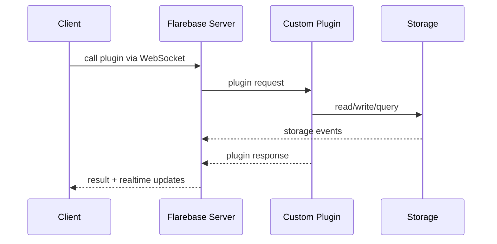

# Architecture Overview

Flarebase ???????????? BaaS?????????????????????:

1. ?????????????????
2. ????? WebSocket ????? REST ?????
3. ?????????????

## ????

### 1. WebSocket-first

???????,Flarebase ??????????????????????????????? UI ????? WebSocket ???

### 2. REST is auxiliary

REST ??????????????:

- SSR / SSG
- `useSWR` / `useSwr`
- ??????
- ?????????

### 3. Plugin, not webhook

????????????? `custom plugin`:

- ???????? worker
- ?? WebSocket ????
- ?? WebSocket ????
- ?? WebSocket ????

???? webhook ?????webhook ?“??????? POST ??”;plugin ?“????????????”?

## ????

### Server

Flarebase Server ??????:

- WebSocket: ?????????????????
- REST: ?????? SSR/SWR ??

### Storage

?????:

- collection/document CRUD
- query ??
- batch / transaction
- sync policy ??

### Custom Plugin Runtime

???????:

- ????
- ????
- ???????
- ???????

????????? `HookManager` ? `hook_request` / `hook_response` ??????,????????? plugin runtime?

## ????????

## ????

Flarebase ?? session-scoped collection:

- ????:`_session_{sid}_{name}`
- ????:????????? OTP ??????????????

??????????????????????

## ? SSR ???

- Client component / SPA: WebSocket-first
- Server component / SSR render: REST-first
- ??:??? SSR,???????? UI ?????,???????

## ??????????

| ??? | ????? |
| --- | --- |
| custom plugin | `FlareHook` / `callHook` |
| plugin request | `hook_request` |
| plugin response | `hook_response` |
| plugin manager | `HookManager` |

?????????,??????????
