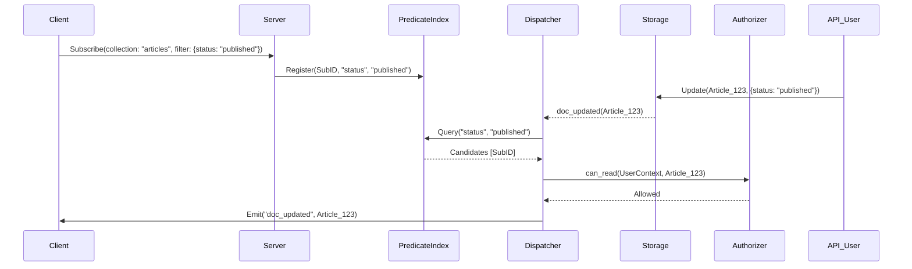

# Design Document: Flarebase Reactive Subscription & High-Efficiency Notification System

## 1. Overview

The goal of this system is to provide a high-performance, real-time data synchronization layer that handles both simple document changes and complex relational updates (junction tables) without the overhead of global broadcasts or excessive server-side re-computation.

## 2. Core Architecture: The Two-Stage Dispatcher

Flarebase implements a **Reactive Dispatcher** that shifts the task of "matching" from the database query engine to a specialized in-memory **Predicate Index**.

### Stage 1: Predicate-Based Candidate Selection
- **Equality Indexing**: All active subscriptions are indexed by the fields and values they filter on (e.g., `status: "published"`).
- **ID Interest Register**: Subscriptions for specific documents (e.g., a user profile) are stored in an $O(1)$ map: `DocumentId -> Set<SubscriptionId>`.
- **Logic**: When a document `D` is updated, the dispatcher instantly identifies candidates by looking up the changed fields and the document ID in these maps.

### Stage 2: Fine-Grained Filtering & Permissioning
- **Full Evaluation**: Candidates undergo a complete expression check (handling `Gt`, `Lt`, `And`, `Or`) using the existing `match_op` logic.
- **Authorization**: The `Authorizer` is invoked for each *final* candidate to ensure the user has `can_read` permission for the specific state of the document.

## 3. Key Design Features

### 3.1 Path-Aware Subscriptions (Single Record Configuration)
To handle configuration changes efficiently:
- **Concept**: Subscriptions can target specific JSON paths (e.g., `settings.ui.theme`).
- **Optimization**: The server maintains a "Previous State Cache" for configuration docs. A notification is ONLY triggered if the value at the specified path has changed (`new_val[path] != old_val[path]`).

### 3.2 List vs. ID Dispatching (Multi-Record Tables)
- **ID Subscriptions**: Handled via the Interest Register. Zero computation overhead for direct document watchers.
- **List Subscriptions**: Handled via the Predicate Index. 
  - *Add*: New docs are tested against query predicates.
  - *Enter/Exit View*: If an update changes a field such that the doc now matches (or no longer matches) a query, the system sends an `added` or `removed` event to the list subscriber.

### 3.3 Relational Logic (Junction Tables)
To handle "My Articles" efficiently:
- **Reactive Linkage**: A subscription to a junction table (e.g., `user_articles`) automatically registers the subscriber's "interest" in the related `article_id`s.
- **Propagation**: When an Article is updated, the system checks if any subscribers are "linked" to it via a junction interest, even if they aren't directly filtering the Articles collection.

## 4. Technical Components

| Component | Responsibility | Performance |
| :--- | :--- | :--- |
| **SubscriptionManager** | Root service managing socket lifecycle and subscription state. | $O(S)$ |
| **PredicateIndex** | Reverse index of filters (Field -> Value -> SubId). | $O(1)$ for equality |
| **InterestRegister** | Direct mapping of DocId to Subscribing Sockets. | $O(1)$ |
| **PathDiffEngine** | JSON path extraction and comparison logic. | $O(Depth)$ |

## 5. Sequence Diagram: Data Propagation



## 6. Optimization Summary

- **Network**: Only relevant data is pushed. No "polling" or "full collection syncing".
- **CPU**: No linear scanning of subscriptions. Permission checks only run for qualified candidates.
- **Memory**: Indices are maintained in-memory and cleaned up automatically on socket disconnect.

## 7. Client-Side Usage (SDKs)

The Flarebase SDKs provide a reactive interface that manages the lifecycle of subscriptions and the initial synchronization state.

### 7.1 Lifecycle & Loading State
1.  **Subscription Request**: Client sends `subscribe` with query.
2.  **Initial Pull**: Server immediately fetches matching docs and sends them as an `initial_data` packet.
3.  **Loading Completion**: Once the initial data is received, the client sets `loading = false`.
4.  **Live Updates**: Server then pipes incremental updates (`added`, `modified`, `removed`).

### 7.2 React Hook (`useSubscription`)
```javascript
import { useSubscription } from '@flarebase/react';

function ArticleList() {
  const { data: articles, loading, error } = useSubscription(
    flare.collection("articles").where("status", "==", "published")
  );

  if (loading) return <Spinner />;
  if (error) return <ErrorMessage error={error} />;

  return (
    <ul>
      {articles.map(article => (
        <li key={article.id}>{article.title}</li>
      ))}
    </ul>
  );
}
```

### 7.3 Vue Composable (`useSubscription`)
```javascript
import { useSubscription } from '@flarebase/vue';

export default {
  setup() {
    const { data: articles, loading, error } = useSubscription(
      flare.collection("articles").where("status", "==", "published")
    );

    return { articles, loading, error };
  }
}
```

### 7.4 Vanilla JS Logic
```javascript
const unsubscribe = flare
  .collection("articles")
  .onSnapshot({
    next: (snapshot) => {
      // snapshot.data contains current records
      // snapshot.isInitial Data tells if loading is complete
    },
    error: (err) => console.error(err)
  });
```

## 8. Order & Limit Handling (Window Management)

To maintain correctness for queries with `limit` and `order`, the system implements **Boundary Tracking**.

### 8.1 Server-side Boundary Management
- **Token Tracking**: For subscriptions with `limit`, the server identifies the "Boundary Value" (sort key of the last item in the view).
- **Push-out Events**: When a new document enters the top-N view, the server sends a `doc_deleted` (or `pushed_out`) event for the item that was displaced.
- **Fill-in Events**: When an item leaves a limited view (deleted or updated), the server performs a shallow query to find the next available document and sends it as a `doc_created` event.

### 8.2 Performance Considerations
- **Lazy Fill-in**: To reduce DB load, "Fill-in" queries can be throttled or only triggered if the client explicitly requests a window refresh.

## 9. Client-side Reactive Cache & Automatic Adaptation

The Flarebase Client SDK is **strictly required** to implement internal state management to provide an "automatic" feel.

### 9.1 The Stateful Observer Pattern
The SDK must maintain an internal representation of the query results. For every event received, the following actions MUST occur:
- **On `doc_created`**:
  - Evaluate against local filters (redundancy check).
  - Insert into sorted list at the correct position.
  - Trim the list if it exceeds the `limit`.
- **On `doc_updated`**:
  - Update document data in the local map.
  - **Re-evaluate Filter**: If it no longer matches (e.g., status changed), move to "Removed".
  - **Re-sort**: Adjust position if the sort key changed.
- **On `doc_deleted`**:
  - Remove from the local map and sorted list.

### 9.2 Emphasized Implementation Requirements
> [!IMPORTANT]
> **Automatic UI Sync**: The SDK should expose reactive primitives (React hooks, Vue refs) that update automatically. The end-user developer should NOT have to manually push/pull data from arrays.

> [!CAUTION]
> **Stale Cache Prevention**: If the client loses connection, the SDK MUST re-sync the entire initial data set upon reconnection to prevent divergence from the server's state.

## 10. Summary of Efficiency Gains

- **Zero Global Broadcasts**: Subscriptions are direct and targeted.
- **Minimal Bandwidth**: Only deltas and boundary shifts are transmitted.
- **Predictable Server Load**: Computation is concentrated on initial sync and targeted matching, not on continuous polling.
