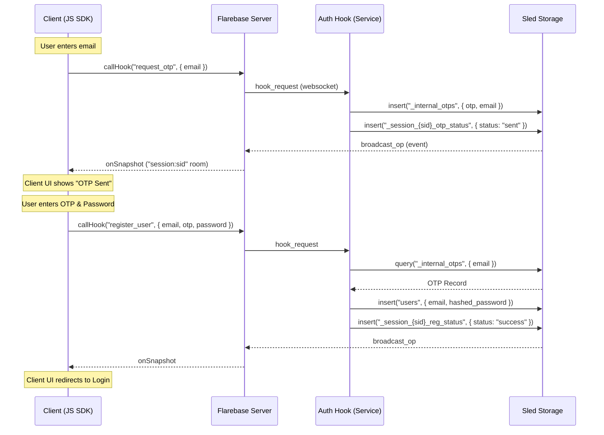

# Flarebase Workflow Guide: Registration & Articles

This document provides a detailed breakdown of the key interaction patterns between the Client SDK, the Flarebase Server, and external Hooks for the two most common workflows.

---

## 🔐 1. User Registration Flow

The registration flow uses the **Stateful WebSocket Hook** pattern to handle the asymmetric logic of verification and account creation.

### Sequence Overview



### Key Code Snippets

#### Client: Triggering the Process
```javascript
// 1. Request OTP
await flare.callHook('request_otp', { email: 'user@example.com' });

// 2. Listen for status (Session Table)
flare.sessionTable('otp_status').onSnapshot((doc) => {
    if (doc.status === 'sent') showNotification('Check your email!');
});

// 3. Final Registration
const result = await flare.callHook('register_user', { 
    email: 'user@example.com', 
    otp: '123456', 
    password: 'secure_password' 
});
```

#### Hook: Processing the Request
```javascript
hook.on('request_otp', async (req) => {
    const otp = generateSecureOTP();
    // Private storage for verification
    await flare.collection('_internal_otps').add({ email: req.params.email, otp });
    // Public session-scoped notification
    await flare.collection(`_session_${req.sessionId}_otp_status`).add({ status: 'sent' });
    return { success: true };
});
```

---

## 📝 2. Article Management Flow

The article flow demonstrates the interaction between the **Generic SDK**, **Rust Authorizer**, and **Sync Policies**.

### Flow Overview
1.  **Draft Creation**: Client creates a document with `published: false`.
2.  **Authorization**: Flarebase checks `permissions.rs` to ensure the creator owns the ID.
3.  **Submission**: Author updates the document status.
4.  **Moderation**: An Admin Hook or client updates `published: true`.
5.  **Redacted Broadcast**: The article is synchronized to public subscribers, but sensitive internal metadata is stripped.

### Key Code Snippets

#### Server: Rust Permission Logic (`permissions.rs`)
```rust
impl Authorizer {
    pub fn can_write(ctx: &PermissionContext, resource: &Value) -> Result<bool> {
        match ctx.resource_type {
            ResourceType::Article => {
                let author_id = resource.get("author_id").and_then(|a| a.as_str());
                // Ensure only the author can modify their draft
                if author_id == Some(&ctx.user_id) {
                    return Ok(true);
                }
                Err(anyhow::anyhow!("Permission denied"))
            }
            _ => Ok(false)
        }
    }
}
```

#### Client: Publishing Workflow
```javascript
const articles = flare.collection('articles');

// 1. Create Draft
const draft = await articles.add({ 
    title: 'My Story', 
    author_id: 'user_1', 
    published: false 
});

// 2. Publish (Admin Action)
await articles.doc(draft.id).update({ published: true });
```

#### Visibility: Sync Policy (`__config__`)
To ensure `internal_notes` or `moderator_id` aren't leaked to the public feed:
```json
{
  "id": "sync_policy_articles",
  "data": {
    "internal": ["moderator_id", "internal_notes", "approval_timestamp"]
  }
}
```
*Flarebase `broadcast_op` will automatically strip these fields before they reach standard WebSocket subscribers.*
