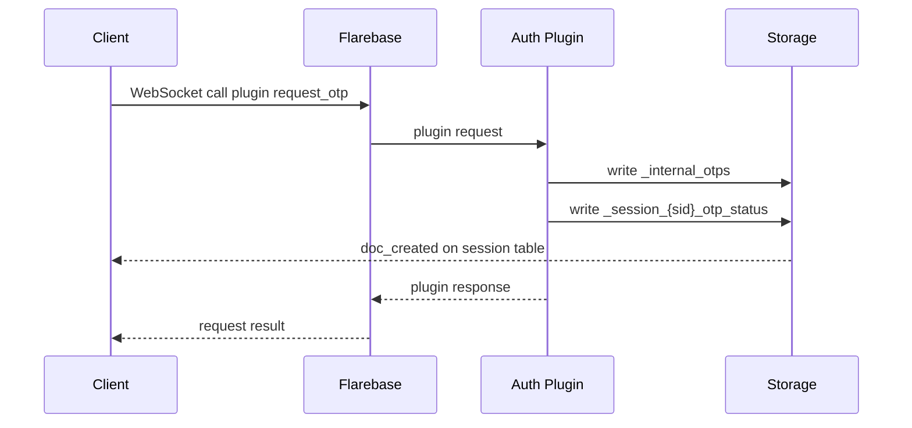

# Workflow Examples

????????????:?????????????“plugin”??????????? hook API?

## 1. ?? / OTP ??

### ??

- ???????
- ????????
- ???????????

### ????



### ?????

```ts
await db.callHook('request_otp', { email: 'user@example.com' });

db.sessionTable('otp_status').onSnapshot((change) => {
  console.log(change);
});
```

?????????“call plugin”??? SDK ?????????

### ???????

- ?????????
- ????? session collection
- ?????????? HTTP endpoint

## 2. ???? / SEO ??

### ??

- ??? SSR
- ???????????

### ????

1. SSR ?? REST named query ???????
2. ?? hydration ??? WebSocket ???
3. ??????,??????????

### ??

```ts
const initialPosts = await db.namedQuery('list_published_posts', {
  limit: 10,
});
```

??????:

```ts
const unsubscribe = db.collection('posts').onSnapshot((change) => {
  console.log(change);
});
```

## 3. ??????

??????????????????

### ????

1. ????? WebSocket ?????
2. ????????????
3. ???????? `_session_{sid}_job_status`?
4. ?????? session collection ??? UI?

### ??

```json
{ "status": "queued", "job_id": "job_123" }
{ "status": "running", "progress": 45 }
{ "status": "done", "progress": 100 }
```

?????????????????????
